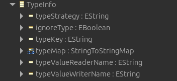

# Codec Type Info

This document is intended to describe how the serialization/deserialization of the type information works in our codec.

A more detailed view of the (de-)serialization supported strategies can be found [here](./CodecTypeInfoStrategies.md)

## The Model

The `TypeInfo` object is defined in our `codec-info`model (`org.eclipse.fennec.codec.info.model`):



It consists of:

+ `typeStrategy`: the strategy to be used when (de-)serializing the type information. Supported values are:
  + `NAME`: uses the class name
  + `CLASS`: uses the instance class name
  + `URI`: uses the class URI
+ `ignoreType`: to specify whether the type information should be ignored or not (default is `false`)
+ `typeKey`: to specify the String to look for when deserializing and the one to use when serializing the type information
+ `typeMap`: this is the type mapping, where the keys are the values we can expect to encounter for the `typeKey` and the values are the corresponding type we should map the object to. The values have to be consistent with the `typeStrategy` (e.g. if `typeStrategy` is `NAME` then, the mapped value cannot be a URI, but it must be a class name) or with the action of the `CodecValueReader/Writer`
+ `typeValueReaderName`: specify a `CodecValueReader` name to be used when deserializing. If none is specified, this is set according to the `typeStrategy` . If this is set, this will overwrite the one set based on the `typeStrategy` (e.g. `typeStrategy` is not set, but `typeValueReaderName` has been set to `URI`, then the type token to be deserialized has to be an URI)
+ `typeValueWriterName` specify a `CodecValueWriter` name to be used when serializing. If none is specified, this is set according to the `typeStrategy`. If this is set, it will overwrite the one determined by the `typeStreategy` (e.g. `typeStrategy` is `NAME`, but `typeValueWriterName` is `URI`, then in the serialized document we have to expect a URI as type value for the `typeKey`)

## The Type Key

The `typeKey` can be:

+ the name of an `EAttribute` of the object we want to serialize;
+ the path to an `EAttribute` of a **contained** `EReference` of the object we want to serialize;
+ a completely different String with no match in the object we want to serialize.

So, let's say we have a `Person` with an attribute `name` and a **contained** reference to an `Address`, which has a `street` attribute. The `typeKey`could be, for instance:

+ `name` : to match the `name` attribute of `Person`
+ `address.street`: to match the `street` attribute of the `address` reference of `Person`
+ `typeOfPerson`: a completely different String which has no match in the `Person` model.

## Serialization

If the `typeKey` matches one of the `EObject` features, then there is nothing special to do, as the feature will be serialized as usual.

If, instead, it consists of another `String`, the type of the object will be, first converted using the `CodecValueWriter` and then a match will be looked for in the `typeMap`. If a match is found, then the corresponding `typeMap` key will be serialized, otherwise the original object type after applying the `CodecValueWrtier` is serialized.

## Deserialization

When deserializing an object, we will go over the deserialized document and look for the `typeKey`. If a match is found, we then will look at the value of such token and we will look in the `typeMap` for a key with that value. If one is found then we will deserialize the corresponding `typeMap` value with the `CodecValueReader`. 

If no match is found in the `typeMap`, then we will try to directly deserialize the token value with the `CodecValueReader`.

## Annotations

The TypeInfo can be set either through model annotations or through save/load options. 

The type annotation can be placed either at the level of an `EClass` or at the level of an `EReference`. 

The source of the `EAnnotation` is `codec.type`; The details entry keys are:

+ `typeKey`: to set the `typeKey` property
+ `strategy`: to set the `typeStrategy`
+ `include`: to set the `typeIgnore` property
+ additional key, value pairs will be interpret for the `typeMap` property.

 ## Save/Load Options

All the properties of the TypeInfo can be overwritten through load/save options. They have to be grouped by `EClass` or `EReference`, depending on which element the properties should apply. So, for an `EClass` using the `CodecResourceOptions.CODEC_OPTIONS`, which then accepts a Map whose keys are the `EClass` and the values are the map of options specific for that class. While, for an `EReference` the same, but the `CodecResourceOptions.CODEC_OPTIONS` should be then passed as key of the class options to which the reference belongs.

The options to be used are the following:

+ `CodecModelInfoOptions.CODEC_TYPE_KEY`: to overwrite the `typeKey`;
+ `CodecModelInfoOptions.CODEC_TYPE_STRATEGY`: to overwrite the `typeStrategy`;
+ `CodecModelInfoOptions.CODEC_TYPE_INCLUDE`: to overwrite the include annotation;
+ `CodecModelInfoOptions.CODEC_TYPE_MAP`: to overwrite or merge into the `typeMap`;
+ `CodecModelInfoOptions.CODEC_TYPE_MAP_STRATEGY`: to specify whether to merge or overwrite the `typeMap` constructed via annotations with the one passed via options. Default is that the one passed via options will overwrite the one defined in the model annotations.
+ `CodecModelInfoOptions.CODEC_TYPE_VALUE_READER`: to register a custom `CodecValueReader`
+ `CodecModelnfoOptions.CODEC_TYPE_VALUE_WRITER`: to register a custom `CodecValueWriter`

## Examples

### Example 1

The easiest example is the default one, when no annotation nor option for the type info is provided. In this case, the `typeKey` is expected to be `_type`, and the strategy is `URI`. So, a deserializable document with the default option would be:

```json
{
    "_type": "http://example.de/person/1.0#//Person",
    "name": "Mario",
    "address": {
        "_type": "http://example.de/person/1.0#//Address",
        "street": "Via Giuseppe Garibaldi"
    }
}
```

### Example 2

If we want to change the `typeKey` during (de-)serialization, we have to overwrite that option for the relative `EClass` or `EReference` we want.

+ To change only the `EClass` `typeKey`, for instance:

```java
EClass personCl = PersonPackage.eINSTANCE.getPerson();
Map<String, Object> options = new HashMap<>();
Map<String, Object> classOpt = new HashMap<>();
classOpt.put(CodecModelInfoOptions.CODEC_TYPE_KEY, "eClass");
options.put(CodecResourceOptions.CODEC_OPTIONS, Map.of(personCl, classOpt));
options.put(CodecResourceOptions.CODEC_ROOT_OBJECT, personCl);
resource.load(options); //or resource.save(options);
```

```json
{
    "eClass": "http://example.de/person/1.0#//Person",
    "name": "Mario",
    "address": {
        "_type": "http://example.de/person/1.0#//Address",
        "street": "Via Giuseppe Garibaldi"
    }
}
```


+ To change the `typeKey` only for the `EReference`, instead:

```java
EClass personCl = PersonPackage.eINSTANCE.getPerson();
EReference addRef = PersonPackage.eINSTANCE.getPerson_Address();
Map<String, Object> options = new HashMap<>();
Map<String, Object> classOpt = new HashMap<>();
Map<String, Object> refOpt = new HashMap<>();
refOpt.put(CodecModelInfoOptions.CODEC_TYPE_KEY, "eClass");
classOpt.put(CodecResourceOptions.CODEC_OPTIONS, Map.of(addRef, refOpt));
options.put(CodecResourceOptions.CODEC_OPTIONS, Map.of(personCl, classOpt));
options.put(CodecResourceOptions.CODEC_ROOT_OBJECT, personCl);
resource.load(options); //or resource.save(options);
```

```json
{
    "_type": "http://example.de/person/1.0#//Person",
    "name": "Mario",
    "address": {
        "eClass": "http://example.de/person/1.0#//Address",
        "street": "Via Giuseppe Garibaldi"
    }
}
```


### Example 3

If we want to change the `strategy` during (de-)serialization, we have to overwrite that option for the relative `EClass` or `EReference` we want.

+ To change only the `EClass` `typeKey`, for instance:

  ```java
  EClass personCl = PersonPackage.eINSTANCE.getPerson();
  Map<String, Object> options = new HashMap<>();
  Map<String, Object> classOpt = new HashMap<>();
  classOpt.put(CodecModelInfoOptions.CODEC_TYPE_STRATEGY, "NAME");
  options.put(CodecResourceOptions.CODEC_OPTIONS, Map.of(personCl, classOpt));
  options.put(CodecResourceOptions.CODEC_ROOT_OBJECT, personCl);
  resource.load(options); //or resource.save(options);
  ```

  ```json
  {
      "_type": "Person",
      "name": "Mario",
      "address": {
          "_type": "http://example.de/person/1.0#//Address",
          "street": "Via Giuseppe Garibaldi"
      }
  }
  ```

+ To change it only for the `ERefenrence`, follow the same path as **Example 2** but instead of using the `CodecModelInfoOptions.CODEC_TYPE_KEY options use the CodecModelInfoOptions.CODEC_TYPE_STRATEGY` options.

+ To change it for both, combine the options for the `EClass` and the one for the `EReference`.

### Example 4

If you want to add a `typeMap`, which by default is empty, you can also do that through the options. For instance, suppose you have multiple kinds of `Address` in your model, like a `CompanyAddress`, a `PersonalAddress` and a `HolidayAddress`. Then you can do something like:

```java
EClass personCl = PersonPackage.eINSTANCE.getPerson();
EReference addRef = PersonPackage.eINSTANCE.getPerson_Address();
Map<String, Object> options = new HashMap<>();
Map<String, Object> classOpt = new HashMap<>();
Map<String, Object> refOpt = new HashMap<>();
refOpt.put(CodecModelInfoOptions.CODEC_TYPE_MAP, Map.of(
"company", "http://example.de/person/1.0#//CompanyAddress",
"personal", "http://example.de/person/1.0#//PersonalAddress",
"holiday", "http://example.de/person/1.0#//HolidayAddress",
));
classOpt.put(CodecResourceOptions.CODEC_OPTIONS, Map.of(addRef, refOpt));
options.put(CodecResourceOptions.CODEC_OPTIONS, Map.of(personCl, classOpt));
options.put(CodecResourceOptions.CODEC_ROOT_OBJECT, personCl);
resource.load(options); //or resource.save(options);
```

```json
{
    "_type": "Person",
    "name": "Mario",
    "addresses": [{
        "_type": "personal",
        "street": "Via Giuseppe Garibaldi"
     }, 
     {
        "_type": "company",
        "street": "Via dei Lavoratori"
     }, 
     {
         "_type": "holiday",
         "street": "Lungomare di Cervia"
     }]
}
```

So, if a `typeMap` is found, the (de-)serializer tries first to (de-)serialize, based on the `streatgy`, what it finds in the map values. If the `typeMap` is empty or no match has been found, then, the serializer serializes the object/reference type based on the `strategy` and the deserializer tries to deserialize the token it finds based on the `strategy`.

### Example 5

If you want to pass as a `typeKey` not a simple attribute name but an attribute of a reference, you can do that like this:

```java
EClass personCl = PersonPackage.eINSTANCE.getPerson();
Map<String, Object> options = new HashMap<>();
Map<String, Object> classOpt = new HashMap<>();
classOpt.put(CodecModelInfoOptions.CODEC_TYPE_KEY, "model.type");
options.put(CodecResourceOptions.CODEC_OPTIONS, Map.of(personCl, classOpt));
options.put(CodecResourceOptions.CODEC_ROOT_OBJECT, personCl);
resource.load(options); //or resource.save(options);
```

```json
{
  "name": "Mario",
  "model": {
      "type": "http://example.de/person/1.0#//Person"
  }
}
```

If no `typeMap` is provided, then the value of the `typeKey` must be a (de-)serializable value according to the `strategy`. So, in this case we are using the default `strategy`, which is `URI` and so a `URI` is provided.

If a `typeMap` is provided instead, then the map key of the value which matches the result of the (de-)serialization according  to the `strategy` has to be used.

```java
EClass personCl = PersonPackage.eINSTANCE.getPerson();
Map<String, Object> options = new HashMap<>();
Map<String, Object> classOpt = new HashMap<>();
classOpt.put(CodecModelInfoOptions.CODEC_TYPE_KEY, "model.type");
classOpt.put(CodecModelInfoOptions.CODEC_TYPE_MAP, Map.of(
	"person", "http://example.de/person/1.0#//Person",
    "business", "http://example.de/person/1.0#//BusinessPerson"
));
options.put(CodecResourceOptions.CODEC_OPTIONS, Map.of(personCl, classOpt));
options.put(CodecResourceOptions.CODEC_ROOT_OBJECT, personCl);
resource.load(options); //or resource.save(options);
```

```json
{
  "name": "Mario",
  "model": {
      "type": "person"
  }
}
```


### Example 6

You can also pass your own `CodecValueReader` or `CodecValueWriter`. This might be useful if you have to deserialize a document and it is somehow complicated to extract the type information. 

```java
public static final CodecValueReader<String, EClass> TEST_TYPE_READER = new CodecValueReader<>() {
		@Override
		public String getName() {
			return "TEST_TYPE_READER";
		}

		@Override
		public EClass readValue(String value, DeserializationContext ctxt) {
			if(value == null) return null;
			if(value.startsWith("test.")) value = value.substring(5);
			return CodecIOHelper.findEClassByName(value, null);
		}
	};
EClass personCl = PersonPackage.eINSTANCE.getPerson();
Map<String, Object> options = new HashMap<>();
Map<String, Object> classOpt = new HashMap<>();
classOpt.put(CodecModelInfoOptions.CODEC_TYPE_VALUE_READER, TEST_TYPE_READER);
options.put(CodecResourceOptions.CODEC_OPTIONS, Map.of(personCl, classOpt));
options.put(CodecResourceOptions.CODEC_ROOT_OBJECT, personCl);
resource.load(options); 

```

```json
{
    "_type": "test.Person",
    "name": "Mario",
    "address": {
        "_type": "http://example.de/person/1.0#//Address",
        "street": "Via Giuseppe Garibaldi"
    }
}
```


